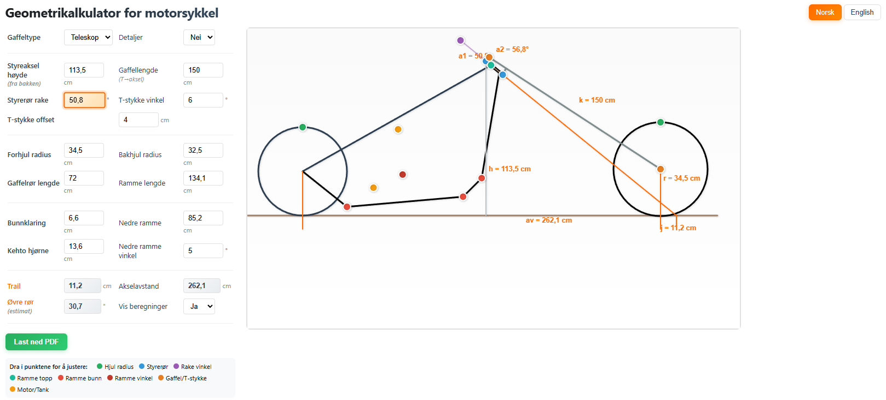

# Rammegenerator (motorsykkel-geometri)

En enkel nettbasert kalkulator/tegner for motorsykkel-geometri (rake, trail, hjulbase m.m.) med interaktiv redigering direkte i tegningen.

## Bruk

- Åpne `index.html` i en nettleser.
- Juster verdier i skjemaet og se tegningen oppdatere.
- I redigeringsmodus kan du dra punkter i tegningen for å justere geometri.

## Prosjektfiler

- `index.html` – UI + beregninger + tegning
- `wz_jsgraphics.js` – canvas-basert tegnemotor (jsGraphics-shim)
- `motor.png`, `tank.png` – illustrasjoner

## Utvikling

Dette er et statisk prosjekt uten build-steg. Endringer kan testes ved å refreshe siden i nettleseren.
